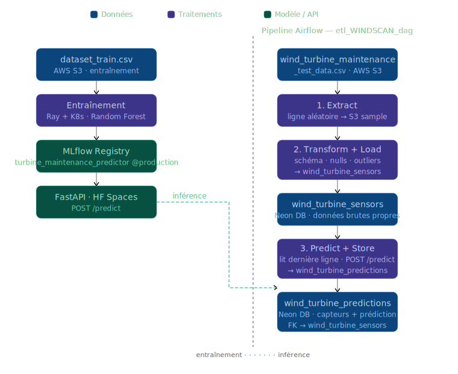

# Maintenance Predictive des Eoliennes — Pipeline MLOps complet

Projet final de la certification AIA (Architecte en Intelligence Artificielle — Jedha).

---

## Contexte

WindScan, opérateur de parcs éoliens, veut anticiper les pannes de turbines avant qu'elles surviennent. Les turbines envoient en continu des mesures capteurs (vitesse rotor, température boîte de vitesses, vibrations...). L'enjeu est de construire un pipeline complet : de l'entraînement distribué du modèle jusqu'à l'inférence automatisée en batch sur les nouvelles données.

---

## Ce que j'ai fait

**Entraînement distribué (Ray sur Kubernetes)**

Un Random Forest entraîné avec `GridSearchCV` (cv=3) sur les données capteurs des turbines. L'entraînement est distribué sur un cluster Ray déployé via l'opérateur KubeRay sur Minikube. `joblib` avec le backend `ray` distribue automatiquement les folds de cross-validation sur les workers.

Le modèle est enregistré dans MLflow sous `turbine_maintenance_predictor` avec l'alias `staging`.

**Serving — FastAPI sur Hugging Face Spaces**

Une API FastAPI charge le modèle depuis MLflow au démarrage et expose deux endpoints : `/health` et `/predict`. Elle tourne dans un conteneur Docker déployé sur Hugging Face Spaces.

**Pipeline d'inférence — DAG Airflow**

Un DAG se déclenche manuellement et enchaîne 4 tâches : création des tables, extraction d'une ligne aléatoire du dataset de test S3, validation + chargement dans `wind_turbine_sensors`, puis inférence via l'API et stockage dans `wind_turbine_predictions`. Un DAG de monitoring tourne quotidiennement avec Evidently pour détecter le drift et déclencher automatiquement le réentraînement.



---

## Stack

- Python — scikit-learn, pandas, FastAPI, MLflow
- Ray 2.x + KubeRay (entraînement distribué)
- Kubernetes — Minikube (cluster local)
- Apache Airflow 2.10 (Docker Compose, LocalExecutor)
- MLflow Model Registry (Hugging Face Spaces)
- AWS S3 (données brutes + prédictions CSV en transit)
- Neon DB (PostgreSQL managé — stockage final des prédictions)
- Hugging Face Spaces (MLflow server + API de serving)

---

## Architecture


---

## Structure

```
Projet-final/
├── docs/
│   └── project_overview_final.md   # Enonce du projet
├── k8s/
│   └── ray_cluster/
│       ├── train_with_ray.py        # Script d'entrainement distribue
│       ├── ray_cluster.yaml         # Helm values KubeRay
│       ├── runtime.yaml             # Env Ray (dependances pip)
│       ├── dataset_train.csv        # Dataset d'entraînement turbines
│       └── requirements.txt
├── modelservedapi/
│   ├── app.py                       # API FastAPI (/health + /predict)
│   ├── Dockerfile
│   └── requirements.txt
├── mlflowfinalproject/
│   └── Dockerfile                   # MLflow server sur HF Spaces
├── airflow/
│   ├── dags/
│   │   ├── etl_WINDSCAN_dag_with_api.py       # DAG ETL + inférence (turbines)
│   │   ├── monitoring_dag.py                  # DAG monitoring drift (Evidently, @daily)
│   │   ├── retraining_dag.py                  # DAG réentraînement Ray (déclenché par monitoring)
│   │   ├── etl_attrition_dag_with_pkl.py      # DAG secondaire (IBM attrition)
│   │   └── tasks_with_api/
│   │       ├── extract_windscan.py             # Tache 1 : extraction S3 aléatoire
│   │       ├── validate_load_sensors.py        # Tache 2 : validation + wind_turbine_sensors
│   │       └── predict_and_store.py            # Tache 3 : inférence + wind_turbine_predictions
│   ├── docker-compose.yaml
│   └── Dockerfile
├── Deployment.md                    # Commandes de deploiement pas a pas
└── README.md
```

---

## Lancer le projet

Voir [Deployment.md](Deployment.md) pour le detail complet. En resume :

```bash
# 1. Demarrer le cluster K8s
minikube start --driver=docker

# 2. Port-forward le dashboard Ray
kubectl port-forward service/raycluster-kuberay-head-svc 8265:8265

# 3. Soumettre l'entrainement
ray job submit --runtime-env=runtime.yaml --address="http://127.0.0.1:8265" -- python train_with_ray.py

# 4. Lancer Airflow
cd airflow && docker-compose up -d
# Interface : http://localhost:8081
```

---

Julien CHARLIER — [(Github : Atomik31)](https://github.com/Atomik31)
