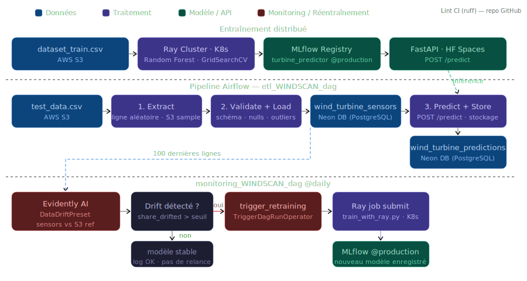

# Maintenance Predictive des Eoliennes — Pipeline MLOps complet

Projet final de la certification AIA (Architecte en Intelligence Artificielle — Jedha).

---

## Contexte

WindScan, opérateur de parcs éoliens, veut anticiper les pannes de turbines avant qu'elles surviennent. Les turbines envoient en continu des mesures capteurs (vitesse rotor, température boîte de vitesses, vibrations...). L'enjeu est de construire un pipeline complet : de l'entraînement distribué du modèle jusqu'à l'inférence automatisée en batch sur les nouvelles données.

---

## Ce que j'ai fait

**Entraînement distribué (Ray sur Kubernetes)**

Un Random Forest entraîné avec `GridSearchCV` (cv=3) sur les données capteurs des turbines. L'entraînement est distribué sur un cluster Ray déployé via l'opérateur KubeRay sur Minikube. `joblib` avec le backend `ray` distribue automatiquement les folds de cross-validation sur les workers.

Le modèle est enregistré dans MLflow sous `turbine_maintenance_predictor` avec l'alias `production`.

**Serving — FastAPI sur Hugging Face Spaces**

Une API FastAPI charge le modèle depuis MLflow au démarrage et expose trois endpoints : `/health` (surveillance du conteneur — utilisé par HF Spaces pour vérifier que le service est up), `/predict` (inférence) et `/docs` (Swagger UI généré automatiquement). Elle tourne dans un conteneur Docker déployé sur Hugging Face Spaces.

**Pipeline d'inférence — DAG Airflow**

Un DAG se déclenche manuellement et enchaîne 4 tâches : création des tables, extraction d'une ligne aléatoire du dataset de test S3, validation + chargement dans `wind_turbine_sensors`, puis inférence via l'API et stockage dans `wind_turbine_predictions`. Un DAG de monitoring tourne quotidiennement avec Evidently pour détecter le drift et déclencher automatiquement le réentraînement.

**Dashboard de monitoring — Streamlit**

Un dashboard Streamlit affiche l'état de la turbine 1 : données capteurs nettoyées (`wind_turbine_sensors` sur Neon DB, alimentée par le DAG Airflow), statistiques sur la fenêtre de temps sélectionnée, et le niveau de maintenance prédit par le modèle (`turbine_maintenance_predictor@production` chargé depuis MLflow). Déployé en conteneur Docker sur Hugging Face Spaces.



### Demo pipeline

[Voir la démo du pipeline en action](../DAG_WINDSCAN_demo.mov)

---

## Stack

- Python — scikit-learn, pandas, FastAPI, MLflow
- Ray 2.x + KubeRay (entraînement distribué)
- Kubernetes — Minikube (cluster local)
- Apache Airflow 2.10 (Docker Compose, LocalExecutor)
- MLflow Model Registry (Hugging Face Spaces)
- AWS S3 (données brutes en transit)
- Neon DB (PostgreSQL managé — stockage des données capteurs et des prédictions)
- Streamlit + Plotly (dashboard de monitoring)
- Hugging Face Spaces (MLflow server, API de serving, dashboard)
- GitHub Actions (CD — déploiement de l'API)

---

## Structure

```
Projet-final/
├── docs/
│   ├── windscan_mlops_pipeline.svg     # Schéma architecture MLOps complet
│   ├── windscan_lignage_donnees.svg    # Lignage de la donnée
│   └── project_overview_final.md       # Énoncé du projet
├── k8s/
│   ├── README.md                       # Setup Minikube + KubeRay
│   └── ray_cluster/
│       ├── train_with_ray.py           # Script d'entraînement distribué
│       ├── ray_cluster.yaml            # Helm values KubeRay
│       ├── runtime.yaml                # Env Ray (dépendances pip + tracking URI MLflow)
│       └── requirements.txt
├── mlflowfinalproject/
│   ├── Dockerfile                      # MLflow server sur HF Spaces
│   ├── requirements.txt
│   └── README.md
├── modelservedapi/
│   ├── app.py                          # API FastAPI (/health + /predict)
│   ├── Dockerfile
│   ├── requirements.txt
│   ├── test_api.ipynb                  # Notebook de test de l'API
│   └── README.md
├── Dashboard-Windscan/
│   ├── app.py                          # Dashboard Streamlit (monitoring turbine 1)
│   ├── Dockerfile
│   ├── requirements.txt
│   └── .streamlit/config.toml
├── airflow/
│   ├── dags/
│   │   ├── etl_windscan_dag_with_api.py       # DAG ETL + inférence (turbines)
│   │   ├── monitoring_dag.py                  # DAG monitoring drift (Evidently, @daily)
│   │   ├── retraining_dag.py                  # DAG réentraînement Ray (déclenché par monitoring)
│   │   ├── etl_attrition_dag_with_pkl.py      # DAG secondaire (IBM attrition)
│   │   ├── tasks_with_api/
│   │   │   ├── extract_windscan.py             # Tâche 1 : extraction S3 aléatoire
│   │   │   ├── validate_load_sensors.py        # Tâche 2 : validation + wind_turbine_sensors
│   │   │   └── predict_and_store.py            # Tâche 3 : inférence API + wind_turbine_predictions
│   │   └── tasks_with_pkl/                     # Tâches du DAG secondaire (IBM attrition)
│   ├── docker-compose.yaml
│   └── Dockerfile
├── .github/workflows/
│   └── deploy_api.yml                  # CD : déploiement de modelservedapi sur HF Spaces
├── scripts/
│   └── seed_last_100_hours.py          # One-shot : seed wind_turbine_sensors/predictions (100h)
├── DAG_WINDSCAN_demo.mov
├── Deployment.md                       # Commandes de déploiement pas à pas
└── README.md
```

---

## Lancer le projet

Voir [Deployment.md](Deployment.md) pour le detail complet. En resume :

```bash
# 1. Demarrer le cluster K8s
minikube start --driver=docker

# 2. Port-forward le dashboard Ray
kubectl port-forward service/raycluster-kuberay-head-svc 8265:8265

# 3. Soumettre l'entrainement
ray job submit --runtime-env=runtime.yaml --address="http://127.0.0.1:8265" -- python train_with_ray.py

# 4. Lancer Airflow
cd airflow && docker-compose up -d
# Interface : http://localhost:8081
```

---

Julien CHARLIER — [(Github : Atomik31)](https://github.com/Atomik31)
